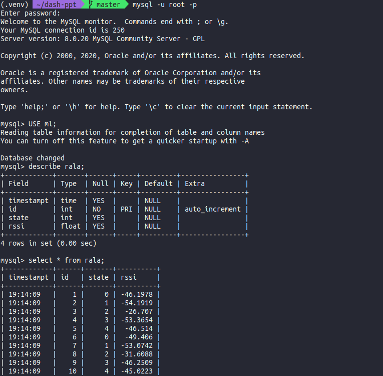

# Dash Wind Streaming

## About

This app queries a MySQL database every second and uses the data to update the RSSI plot for a Reconfigurable Alford Loop Antenna.

The info regarding the database is stored on info.py. Make sure to update once the repo is cloned.

## How to run

Clone this repository and open a terminal inside the root folder. Activate the venv:

`source .venv/bin/activate`

Run the app:

`python app.py`

Open the browser at http://127.0.0.1:8050

If the above didn't work, all you need is a virtual environment with python 3.6.2 and the following requirements:

    dash==1.0.0
    numpy==1.16.4
    pandas==0.24.2
    scipy==1.3.0
    gunicorn==19.9.0
    mysqlclient==1.4.6

If mysqlclient gives you issues, run:

`sudo apt install python3-dev libmysqlclient-dev`

If you don't have virtual environments set up, you can do so with PYENVs (see last section).

## Screenshots

## Setting up the DB

If you run it on an actual Dragon radio node, it will connect to the database. If not you will have to set one up. It should look like this (make sure the name of the db is `ml` or update it in the files (in `api.py`):

### How to create a local DB
#### Set up MySQL

0. Get the `mysql-apt-config` from the mysql webpage
1. Install the downloaded MySQL-apt-package: `sudo dpkg -i /PATH/version-specific-package-name.deb`
2. `sudo apt-get update`
3. `sudo apt-get install mysql-server mysql-shell`
4. You'll be prompted for the password for root, put one and you are ready!

To check, run `sudo service mysql status`, to stop instead of status do `stop`, to start use `start`.

#### Create the DATABASE and a table

1. `mysql -u root -p` - when prompted, put the password used when setting this up
2. `CREATE DATABASE db_name;` - creates DB with name "db_name"
   - `DROP DATABASE db_name` - deletes DB with name "db_name"
3. `USE db_name;` - to use "db_name"
   - `SHOW tables;` - shows the tables within the databse "db_name" (NOTE: if the DB is new, you'll get: “Empty set”).
4. Create the table in the DB we just created:
        CREATE TABLE rala (
        timestampt TIME,
        id INT NOT NULL PRIMARY KEY AUTO_INCREMENT,
        state INT,
        rssi FLOAT)
5. Test it by adding the first entry:
        INSERT INTO `rala` (`timestampt`, `state`, `rssi`) VALUES ('2020-05-08 18:01:25', 4, -12.425);`

### How to populate the DB to run locally

For this purpose, we have `fill_db.py`, it will generate N_samples following a multivariate normal distribution for all K antenna states and store them in a local database (it needs to be previously set up).

### PYENV - to have virtual environments
1. Check out pyenv where you want it installed. A good place to choose is $HOME/.pyenv (but you can install it somewhere else).

        git clone https://github.com/pyenv/pyenv.git ~/.pyenv

2. Define environment variable PYENV_ROOT to point to the path where pyenv repo is cloned and add $PYENV_ROOT/bin to your $PATH for access to the pyenv command-line utility.
        echo 'export PYENV_ROOT="$HOME/.pyenv"' >> ~/.zshrc
        echo 'export PATH="$PYENV_ROOT/bin:$PATH"' >> ~/.zshrc
3. Add pyenv init to your shell to enable shims and autocompletion. Please make sure eval "$(pyenv init -)" is placed toward the end of the shell configuration file since it manipulates PATH during the initialization.
        echo -e 'if command -v pyenv 1>/dev/null 2>&1; then\n eval "$(pyenv init -)"\nfi' >> ~/.zshrc
4. Restart your shell so the path changes take effect. You can now begin using pyenv.
        exec "$SHELL"
5. Install Python build dependencies before attempting to install a new Python version. The pyenv wiki provides suggested installation packages and commands for various operating systems. For ubuntu:
        sudo apt-get update; sudo apt-get install --no-install-recommends make build-essential libssl-dev zlib1g-dev libbz2-dev libreadline-dev libsqlite3-dev wget curl llvm libncurses5-dev xz-utils tk-dev libxml2-dev libxmlsec1-dev libffi-dev liblzma-dev
6. Install Python versions into $(pyenv root)/versions. For example, to download and install Python 2.7.8, run:
        pyenv install 2.x.x # or 3.x.x
        pyenv global x.x.x
        pip install venv
        pip install --upgrade pip #Update pip
        venv .venv # or python -m venv /path/to/new/virtual/environment  

#### To use the venv:
        source .venv/bin/activate
        which python # will tell you what python you are using, in case you aren't sure

**NOTE**: If you are having trouble installing a python version, please visit the wiki page about Common Build Problems (https://github.com/pyenv/pyenv/wiki/Common-build-problems)
How to use PYENV and VENV:

    python versions # will list all options
    python global <version> # will set that python to be system wide

If you have one of those versions as global, it's interesting for example for pycharm to save that system wide python as a venv that can be used later on on a project. So for example lets say we want to have the current system wide python as a venv that can be used by pycharm:

    cd /path/to/project/folder
    pip install venv
    venv .venv # or python -m venv /path/to/new/virtual/environment  

Now we should have a folder .venv that has all the configurations of our system wide python and we can use it with pycharm.

## Resources

- To learn more about Dash, check out the [documentation](https://plot.ly/dash).
